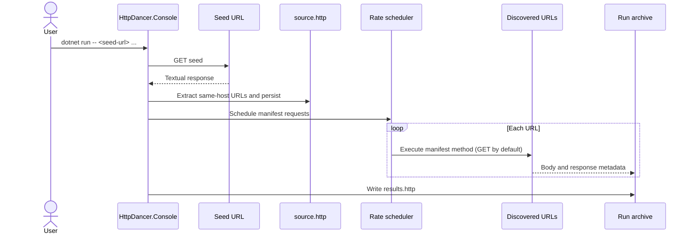

# HttpDancer

HttpDancer is a .NET 10, rate-controlled website archiver. Given one or more seed URLs, it extracts same-host links from each seed response, downloads a bounded one-hop set of URLs, and stores both content and a readable HTTP manifest of the results.

## Run

```bash
dotnet run --project HttpDancer.Console -- https://example.com https://example.org
```

Seeds run sequentially. If no URLs are passed, the console uses `HttpDancer:Download:SeedUrls` from `HttpDancer.Console/appsettings.json`.

Each seed creates a separate directory under:

```text
<workspace>/<safe-host>/<UTC-run-id>/
├── source.http
├── results.http
└── content/
    ├── <safe-url-path>.<extension>
    └── <safe-url-path>.<extension>.meta.json
```

`source.http` is the generated one-hop manifest. `results.http` adds scheduling, status, timing, redirect, correlation, and error headers. Metadata is written for every response; response bodies are written when available.

## Configuration

`HttpDancer:Download` controls the archive workflow:

- `Workspace`: root output directory (default: `archives`).
- `SeedUrls`: fallback URLs when none are passed on the command line.
- `MaxRequestsPerSeed`: maximum deduplicated URLs downloaded from one seed.
- `Rate` and `RateWindow`: request rate for each seed.
- `MaxDegreeOfParallelism`: maximum scheduled downloads running at once.

The existing `HttpDancer:DefaultClient` section controls allowed hosts/content types, request-body behavior, timeouts, user agent, and connection settings.

## Architecture

| Project | Role |
| --- | --- |
| `HttpDancer.Console` | CLI/configuration and sequential seed orchestration. |
| `HttpDancer.Downloading` | Seed parsing, rate-controlled execution, result manifests, and durable filesystem archiving. |
| `HttpDancer.Core` | HTTP client, response model, correlation IDs, and HTTP settings. |
| `HttpDancer.Scheduling` | Generic rated scheduling. |
| `HttpDancer.FileFormats` | Parses/renders REST Client-style `.http` documents. |
| `HttpDancer.Parsing`, `HttpDancer.Naming`, `HttpDancer.KnownMediaTypes` | Link extraction, safe archive names, and content-type extensions. |

The workflow is intentionally one-hop and bounded. It does not recursively crawl pages, minify HTML, or retry failed requests. Use only on sites you are authorized to download and at rates the site can handle.
